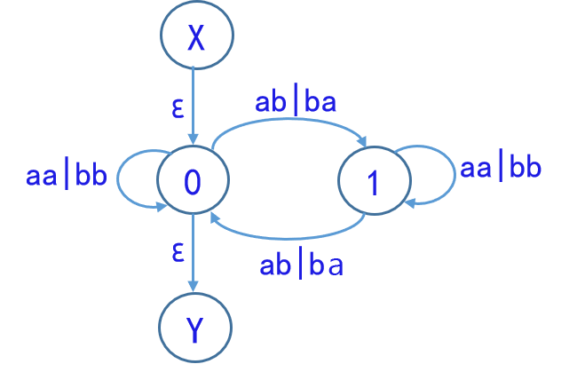
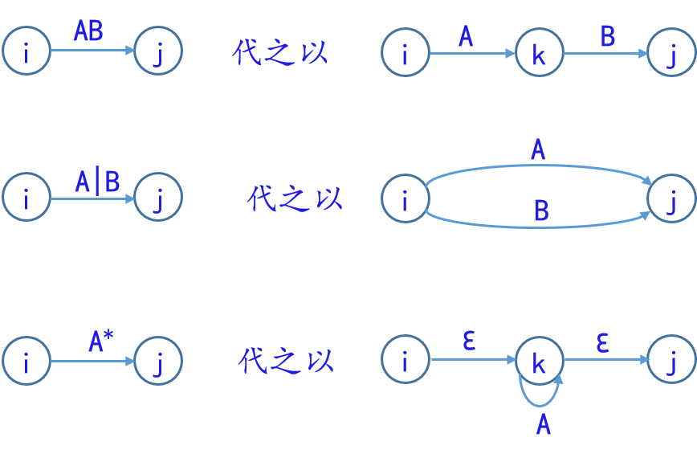

# 词法分析——转换算法

（本章较多图与文字来源于 XDZ 老师的 PPT，笔者负责整理）

本章介绍词法分析中几种表示的转换算法，通过构造来证明不同模型间的等价性（构造性证明）。不同的等价性命题与转换算法的对应关系如下：

|             等价性命题              |                      转换算法                      |
| :---------------------------------: | :------------------------------------------------: |
|    正规文法与 FA（NFA） 的等价性    | 可先证正规文法与正规式的等价性，或参考《编译原理》 |
|     正规式与 FA（NFA） 的等价性     |                   Thompson 算法                    |
|         NFA 与 DFA 的等价性         |                     子集构造法                     |
| DFA 化简（DFA 与简化 DFA 的等价性） |                   Hopcroft 算法                    |

## 正规文法与 FA 的等价性

我们将讨论正规文法与有限自动机（FA）的等价性，你可能会疑惑为何不区分 DFA 和 NFA，这是因为我们随后会给出 NFA 和 DFA 的等价性证明，所以实际上最终归结为正规文法和 FA 等价。

命题表示：对于正规文法$G$ 和有限自动机$M$，如果$L(G) = L(M)$，则称$G$和$M$是等价的。关于正规文法和有限自动机的等价性，有以下结论：

1. 对每一个右线性正规文法$G$ 或左线性正规文法$G$，都存在一个有限自动机（FA）$M$，使得$L(M) = L(G)$。
2. 对每一个有限自动机 $M$，都存在一个右线性正规文法$G_R$和左线性文法$G_L$，使得$L(M) = L(G_n) = L(G_L)$。

### 证明 1：正规文法构造 FA

针对左/右线性文法分类讨论进行构造性证明

1.  右线性正规文法

    设右线性正规文法$G=(V_N,V_T,S,P)$。将$V_N$中的每一非终结符号视为状态符号，并增加一个新的**终结状态符号**$f$，$f \notin V_N$。

    构造 FA，令$M = (V_N \cup \{f\}, V_T, \delta,S,\{f\})$，其中状态转换函数$\delta$由以下规则定义：

    1.  （到终结状态的弧）若对某个$A \in V_N$ 及 $a \in V_T \cup\{ \epsilon \}$，$P$ 中有产生式 $A \rightarrow a$，则令$\delta(A,a) = f$
    2.  （到其他状态的弧）对任意的$A \in V_N$ 及 $a \in V_T \cup\{ \epsilon \}$，设$P$中左端为$A$，右端第一符号位$a$的所有产生式为

        $$A \rightarrow aA_1 | \cdots | aA_k$$

        则令$\delta(A,a) = \{A_1,\cdots,A_k\}$

    显然，上述$M$是一个 NFA。

    对于右线性文法$G$，在初始状态到字$S \overset{+}{\Rightarrow} w$的最左推导过程中，利用$A \rightarrow aB$一次，**就相当于在$M$中从状态$A$经过标记为$a$的箭弧到达状态$B$**。推导的最后（即文法箭头右边不含非终结符的情况）利用$A \rightarrow a$一次，**则相当于在$M$中从状态$A$经过标记为$a$的箭弧到达中介状态$f$**（包括$a = \epsilon$的情形）。

    综上，根据我们的构造和解释，右线性正规文法$G$中，$S \overset{+}{\Rightarrow} w$的充要条件是：在$M$中，从状态$S$到状态$f$有一条通路，其上所有箭弧的标记符号依次连接起来恰好等于$w$。这就是说$w \in L(G) \leftrightarrow w \in L(M)$，故$L(G) = L(M)$。

2.  左线性正规文法

    设左线性正规文法$G=(V_N,V_T,S,P)$。将$V_N$中的每一非终结符号视为状态符号，并增加一个新的**初始状态符号**$q$，$q \notin V_N$。

    与上述右线性正规文法构造性证明类似，我们同样构造一个 FA，不过这里注意自动机初态和终态集略有不同。令$M = (V_N \cup \{q\}, V_T, \delta,q,\{S\})$，其中状态转换函数$\delta$由以下规则定义：

    1.  （起始状态出发的弧）若对某个$A \in V_N$ 及 $a \in V_T \cup\{ \epsilon \}$，$P$ 中有产生式 $A \rightarrow a$，则令$\delta(q,a) = A$
    2.  （其他状态出发的弧）对任意的$A \in V_N$ 及 $a \in V_T \cup\{ \epsilon \}$，设$P$中所有右端第一符号位为$A$，第二符号位为$a$的所有产生式为：

        $$A_1 \rightarrow A a , \cdots , A_k \rightarrow A a$$

    则令$\delta(A,a) = \{ A_1 , \cdots, A_k \}$。

    利用$A \rightarrow a$一次，**相当于在$M$中从状态$q$经过标记为$a$的箭弧到达状态$A$**，利用$A_1 \rightarrow A a$一次，**则相当于在$M$中从状态$A$经过标记为$a$的弧到达状态$A_1$**。与右线性的证明过程类似，不过随着文法推导，字是从末尾符号向初始符号构造，自动机上的弧也是从终结符号按着箭头到箭尾倒序构造。仍有$w \in L(G) \leftrightarrow w \in L(M)$，故 L(G) = L(M)$

我们构造的自动机$M$明显都是 NFA，转换为 DFA，这部分要用到后面章节[NFA 与 DFA 等价性证明](#nfa-与-dfa-的等价性)的内容。

<!-- TODO 添加示例 -->

### 证明 2：FA 构造正规文法

## 正规式与 FA（NFA） 的等价性

### 证明 1：FA 构造正规式

构造的核心思路是将状态转换图逐渐消解，最后转换为单一的正规式表达。

首先把转换图的概念拓广，令每条弧可用一个正规式作标记。为了解决非单一终态等问题，我们在状态机$M$的基础上构造$M'$，$M$转换图上加进两个结，一个为$X$结，另一个为$Y$结；

- 从$X$结用$ε$弧连接到$M$的所有初态结；
- 从 M 的所有终结用$ε$弧连接到 Y 结

显然，$L(M)=L(M')$，即，这两个 NFA 是等价的，且$M'$只有一个初态一个终态。

反复使用下图所示的替换规则，消去所有的结最后达到 X--正规式-->Y。

!!! question "问题"

    下图经消结后，对应的正规式是什么，识别的是什么语言

    

??? success "答案"

    正规式为$((aa|bb)(ab|ba)(aa|bb)*(ab|ba))*$，识别的是**含偶数个a和偶数个b的字**，消去过程如下：

    

    

    

## 证明 2：正规式构造 FA

证明分为两步：

1. 构造$\sum$上的 NFA $M'$，使得$L(M')=L(V)$
2. $M'$确定化

需说明的是，仅步骤 1 我们就已经构造性证明出正规式与 NFA 等价，若要证明和 DFA 等价，则需步骤 2 进行 NFA 确定化，这部分还是后面章节[NFA 与 DFA 等价性证明](#nfa-与-dfa-的等价性)的内容。

第一部分的构造其实很简单，就是[FA 构造正规式](#证明-1fa-构造正规式) 的逆过程。

首先把正规式 $V$ 表示为拓广转换图（X--正规式-->Y），然后通过对 $V$ 进行分裂和加进新结的办法，逐步把这个图转变成：每条弧标记为 $Σ$ 的一个字符或 $ε$。

使用下面的替换规则：

在整个分裂过程中，所有新结均用不同的名字，保留$X$和$Y$为全图唯一的初态结和终态结，至此，得到了一个 NFA $M'$
显然，$L(M')=L(V)$。如果需要进行

## NFA 与 DFA 的等价性

<!-- TODO -->

待完成

## DFA 化简

<!-- TODO -->

待完成
