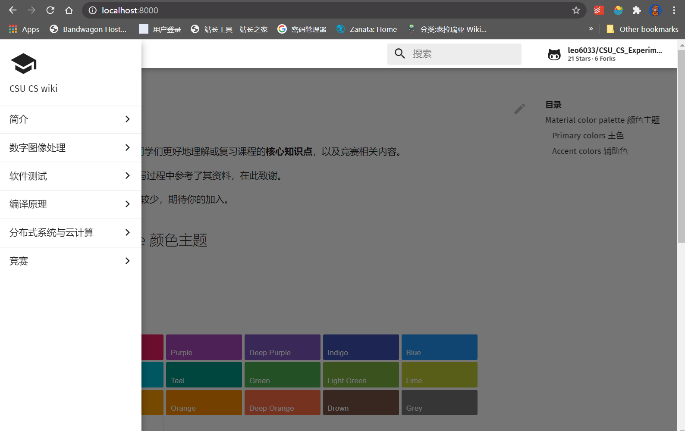

# Quick Start

本项目主要依赖工具`git`，如果你没有使用过`git`，可以参考下面的网站自行学习（~~简单操作 Google 一下就学会了~~）：

- [Git 官方网站](https://git-scm.com/)
- [《精通 Git》学习记录](https://www.edwardzcn98yx.com/post/b8ca3dfa.html)
- [Git 学习笔记 | 简书](https://www.jianshu.com/p/81c6dac77492)

如果您仅贡献代码，掌握`git`，有一个 Github 账号就可以参与到本项目中。但如果您希望编写 Wiki 词条，还需要了解`mkdocs`的相关知识并掌握 markdown 写作风格（~~没那么玄乎，很简单的~~）：

- [Markdown 快速入门 | Github](https://github.com/adam-p/markdown-here/wiki/Markdown-Cheatsheet)
- [MkDocs 网站](https://github.com/mkdocs/mkdocs)

下面是快速配置该项目本地环境的流程。

## Linux

Linux 在 clone 项目后运行 shell 脚本即可配置对应自定义主题。

```bash
git clone git@github.com:disc0ver-csu/csu-cs-wiki.git --depth=1

cd csu-cs-wiki

# 安装 mkdocs，需要 Python3 环境
pip install -U -r requirements.txt -i https://pypi.tuna.tsinghua.edu.cn/simple/

# 使用自定义主题
chmod +x ./scripts/build.sh && ./scripts/build.sh

# 两种方法（选其一即可）：
# 1. 运行一个本地服务器，访问 http://127.0.0.1:8000 可以查看效果 （请注意端口是否被占用）
mkdocs serve

# 2. 在 site 文件夹下得到静态页面
mkdocs build

# 获取 mkdocs 的命令行工具的说明（解释了命令和参数的含义）
mkdocs --help
```

## Windows

Windows 在 CMD 或 Powershell 执行如下指令（注意检查 mkdocs 的环境变量是否正确配置）。

```bash
git clone git@github.com:disc0ver-csu/csu-cs-wiki.git --depth=1

cd csu-cs-wiki

# 安装 mkdocs，需要 Python3 环境
pip install -U -r requirements.txt -i https://pypi.tuna.tsinghua.edu.cn/simple/

# clone主题到本地
git clone --depth=1 https://github.com/leo6033/mkdocs-material.git

# 两种方法（选其一即可）：
# 1. 运行一个本地服务器，访问 http://127.0.0.1:8000 可以查看效果 （请注意端口是否被占用）
mkdocs serve

# 2. 在 site 文件夹下得到静态页面
mkdocs build

# 获取 mkdocs 的命令行工具的说明（解释了命令和参数的含义）
mkdocs --help
```

## Result

配置完成后执行`mkdocs serve`，打开浏览器访问指定端口，应该能看到如下界面：



显示颜色主题色块，即配置完成。
